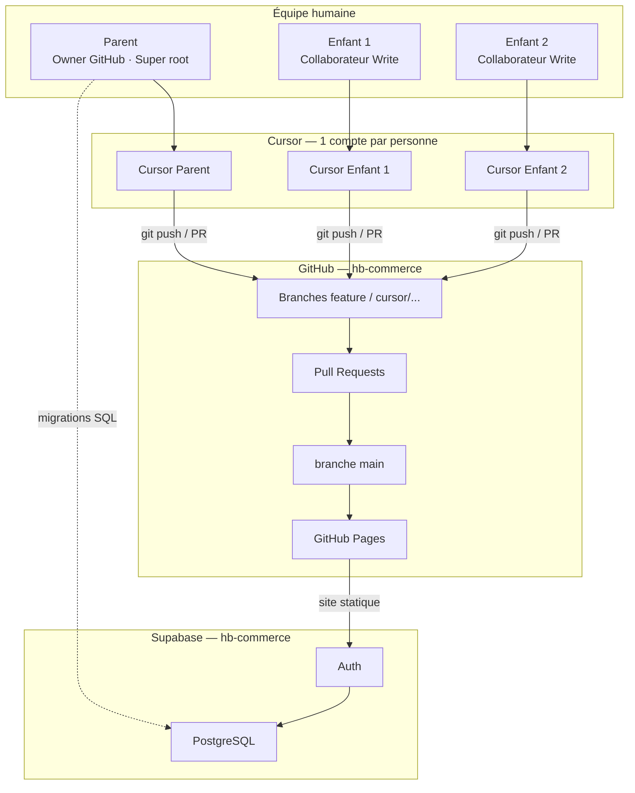
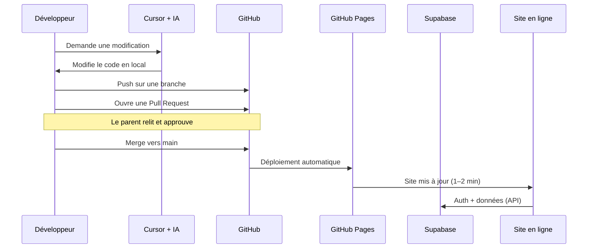

# Guide équipe familiale — HB Commerce

Ce document explique comment **vous et vos enfants** pouvez travailler ensemble sur le projet HB Commerce avec **vos comptes personnels** (GitHub, Cursor, Supabase).

**Dépôt :** [github.com/hbconsultingsrv-arch/hb-commerce](https://github.com/hbconsultingsrv-arch/hb-commerce)  
**Site en ligne :** [hbconsultingsrv-arch.github.io/hb-commerce/](https://hbconsultingsrv-arch.github.io/hb-commerce/)  
**Configuration technique :** [SETUP.md](../SETUP.md)

---

## 1. Vue d'ensemble

| Outil | Comptes | Ressource partagée |
|-------|---------|-------------------|
| **GitHub** | 1 par personne | 1 dépôt `hb-commerce` |
| **Cursor** | 1 par personne | Même dépôt cloné en local |
| **Supabase** | 1 par personne (optionnel) | 1 projet base de données |
| **GitHub Pages** | — | Site déployé depuis `main` |

**Règle d'or :** le code vit sur GitHub, les données vivent sur Supabase, chacun travaille avec **son** compte.

---

## 2. Schéma des intervenants



---

## 3. Schéma des échanges



---

## 4. Rôles détaillés

### 4.1 Parent (vous)

| Domaine | Rôle |
|---------|------|
| GitHub | **Owner** du dépôt — valide les PR, merge vers `main` |
| Supabase | **Owner** du projet — migrations SQL, clés API, équipe |
| Site HB Commerce | Compte **super_root** — gestion des accès internes |
| Cursor | Votre compte — développement et agents IA |

### 4.2 Enfants développeurs

| Domaine | Rôle recommandé |
|---------|-----------------|
| GitHub | **Write** — peut créer des branches et des PR, pas modifier les réglages du dépôt |
| Supabase | **Developer** (invité) ou aucun accès dashboard — comptes de test sur le site |
| Site HB Commerce | Compte **admin**, **agent** ou **client** de test selon la tâche |
| Cursor | Leur propre compte — clone le dépôt, travaille sur des branches |

### 4.3 Cursor (IA)

| Fait | Ne fait pas |
|------|-------------|
| Édite le code (local ou Cloud Agent) | Ne remplace pas GitHub |
| Propose corrections, tests, PR | N'a pas accès Supabase par défaut |
| Utilise le compte GitHub connecté | Chaque personne a sa propre session |

### 4.4 GitHub (`main` déployé)

| Élément | Rôle |
|---------|------|
| Dépôt `hb-commerce` | Code source (HTML, CSS, JS) |
| Branche `main` | Version officielle → déclenche GitHub Pages |
| Branches `cursor/...` ou `feature/...` | Travail en cours |
| Pull Requests | Revue avant fusion |
| GitHub Actions | Tests E2E automatiques |

### 4.5 Supabase (backend partagé)

| Composant | Rôle |
|-----------|------|
| Auth | Inscription, connexion, rôles |
| PostgreSQL | Produits, commandes, profils, stock, chat |
| RLS | Droits par rôle (client, admin, agent…) |
| SQL Editor | Migrations (`supabase/*.sql`) |

> **Un seul projet Supabase** pour toute l'équipe. Ne jamais partager la clé `service_role`.

### 4.6 GitHub Pages (site public)

| Élément | Rôle |
|---------|------|
| Hébergement | Fichiers statiques du dépôt (`main`) |
| URL | `https://hbconsultingsrv-arch.github.io/hb-commerce/` |
| Mise à jour | Automatique après chaque merge sur `main` |

---

## 5. Configuration pas à pas

### 5.1 GitHub — ajouter vos enfants

1. Chaque enfant crée un compte sur [github.com](https://github.com) (avec accord parental si mineur).
2. Sur le dépôt → **Settings** → **Collaborators** → **Add people**.
3. Rôle recommandé : **Write** (pas Admin).
4. Activez éventuellement **Branch protection** sur `main` :
   - Settings → Branches → Add rule → `main`
   - Cocher « Require a pull request before merging »

### 5.2 Cursor — par personne

1. Créer un compte sur [cursor.com](https://cursor.com).
2. Installer **Cursor Desktop**.
3. **Settings → GitHub** → connecter **son** compte GitHub.
4. Cloner le dépôt :

```bash
git clone https://github.com/hbconsultingsrv-arch/hb-commerce.git
cd hb-commerce
```

5. Tester en local :

```bash
python3 -m http.server 8080
```

Puis ouvrir [http://localhost:8080](http://localhost:8080).

6. Copier la config Supabase (une fois) :

```bash
cp js/config.example.js js/config.js
```

Remplir avec les clés du projet (voir [SETUP.md](../SETUP.md) §3–4).  
`config.js` est ignoré par Git — ne pas committer de secrets.

### 5.3 Supabase — accès équipe

**Option A — Parent seul sur le dashboard (recommandé pour jeunes enfants)**

- Vous exécutez les migrations SQL.
- Les enfants testent via le site avec des comptes de démo.

**Option B — Enfants invités en Developer**

1. [supabase.com](https://supabase.com) → projet → **Settings → Team**.
2. Inviter l'e-mail de l'enfant avec le rôle **Developer** (jamais Owner).
3. Ne jamais transmettre la clé `service_role`.

**Comptes de test sur le site**

| Compte demo | Rôle | Page |
|-------------|------|------|
| `super@hbcommerce.demo` | Super root | `super-root.html` |
| `admin@hbcommerce.demo` | Admin | `admin.html` |
| `agent.martin@hbcommerce.demo` | Agent | `agent.html` |
| `contact@restaurant-paris.demo` | Client | `compte.html` |

Mot de passe demo : `Test1234!` (voir [SETUP.md](../SETUP.md) §6bis).

Pour un compte personnel :

```sql
UPDATE public.profiles
SET role = 'admin'
WHERE email = 'email-enfant@exemple.com';
```

---

## 6. Workflow de travail (famille)

```
1. Créer une issue GitHub (bug ou amélioration)
        ↓
2. Créer une branche depuis main
   git checkout -b feature/nom-court
        ↓
3. Travailler avec Cursor (ou à la main)
        ↓
4. Commit + push
   git add .
   git commit -m "Description claire"
   git push -u origin feature/nom-court
        ↓
5. Ouvrir une Pull Request sur GitHub
        ↓
6. Le parent relit → merge vers main
        ↓
7. GitHub Pages redéploie le site (1–2 min)
```

### Conventions de branches

| Préfixe | Usage |
|---------|-------|
| `feature/` | Nouvelle fonctionnalité |
| `fix/` | Correction de bug |
| `cursor/` | Branche créée par un agent Cursor Cloud |

Exemple : `fix/menu-mobile-admin`

---

## 7. Signaler un bug (enfants)

Sur GitHub → **Issues** → **New issue** → choisir le modèle :

- **Bug d'affichage (mobile / tablette)** — pour les problèmes visuels
- **Bug fonctionnel** — pour ce qui ne marche pas (connexion, panier…)

Joindre si possible :

- Une **capture d'écran**
- La **page** concernée (`admin.html`, `index.html`…)
- Le **téléphone ou navigateur** utilisé
- Le **mode clair ou sombre**

---

## 8. Ce qui change quoi

| Action | Effet |
|--------|-------|
| Merge CSS/JS/HTML dans `main` | Site public mis à jour (~1–2 min) |
| Migration SQL sur Supabase | Données / auth modifiées immédiatement |
| Travail sur une branche non mergée | Rien en ligne tant que ce n'est pas fusionné |
| Modification de `config.js` en local | Uniquement sur la machine du développeur |

---

## 9. Sécurité — rappels

| À faire | À ne pas faire |
|---------|----------------|
| Chacun son compte GitHub / Cursor | Partager un mot de passe GitHub |
| PR + relecture avant merge sur `main` | Pousser directement sur `main` sans contrôle |
| Clé **anon** dans `config.js` (publique) | Committer la clé **service_role** Supabase |
| Comptes de test pour les enfants | Donner super_root à un compte enfant sans supervision |

---

## 10. Checklist de démarrage

### Parent

- [ ] Dépôt GitHub accessible
- [ ] Enfants ajoutés comme Collaborators (Write)
- [ ] Protection de la branche `main` (PR obligatoire)
- [ ] Projet Supabase actif (non en pause)
- [ ] Comptes de test créés pour chaque enfant

### Chaque enfant

- [ ] Compte GitHub créé et ajouté au dépôt
- [ ] Compte Cursor créé, GitHub connecté
- [ ] Dépôt cloné en local
- [ ] `config.js` configuré (copie de `config.example.js`)
- [ ] Site testé en local (`python3 -m http.server 8080`)
- [ ] Sait ouvrir une issue et une Pull Request

---

## 11. Liens utiles

| Ressource | Lien |
|-----------|------|
| Dépôt GitHub | https://github.com/hbconsultingsrv-arch/hb-commerce |
| Site en ligne | https://hbconsultingsrv-arch.github.io/hb-commerce/ |
| Configuration Supabase | [SETUP.md](../SETUP.md) |
| Document maître fonctionnel | [FONCTIONNALITES-ET-REGLES-DEMANDEES.md](FONCTIONNALITES-ET-REGLES-DEMANDEES.md) |
| Tests E2E | [TESTS-E2E-SCENARIOS.md](TESTS-E2E-SCENARIOS.md) |

---

*HB Commerce — HB Groupe — Guide équipe familiale*
